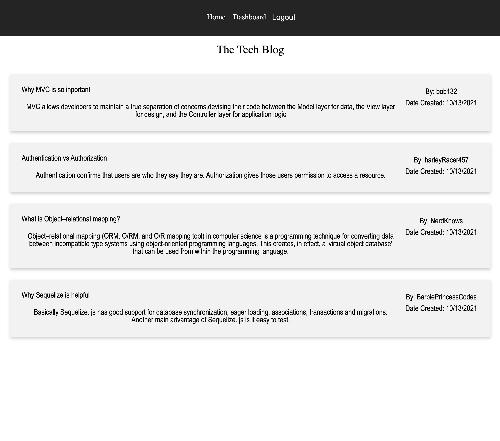
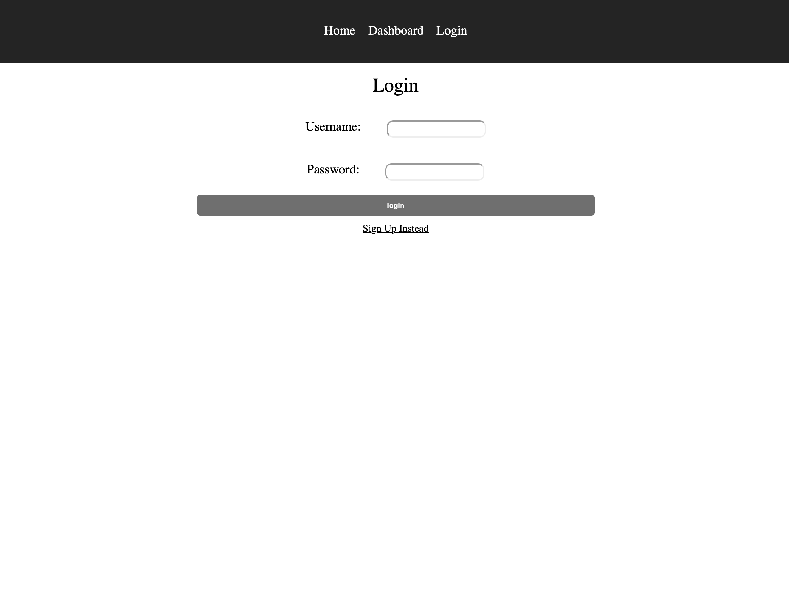
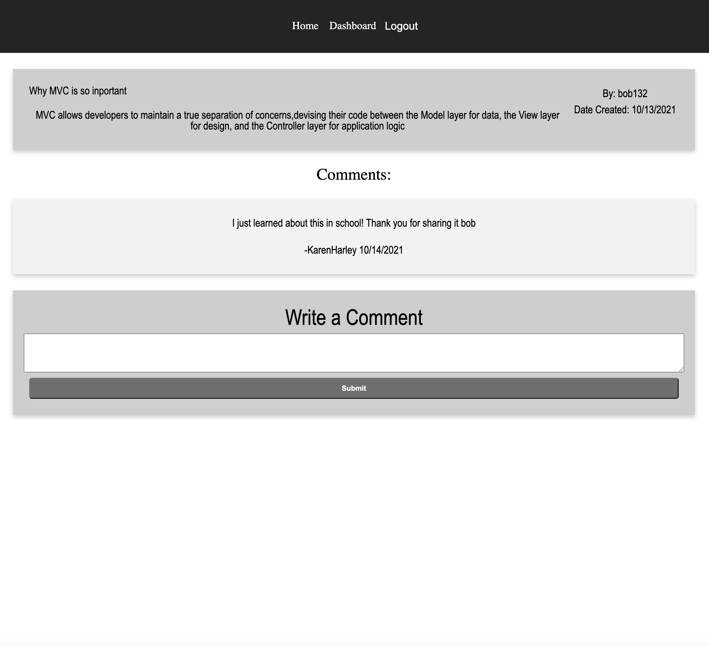
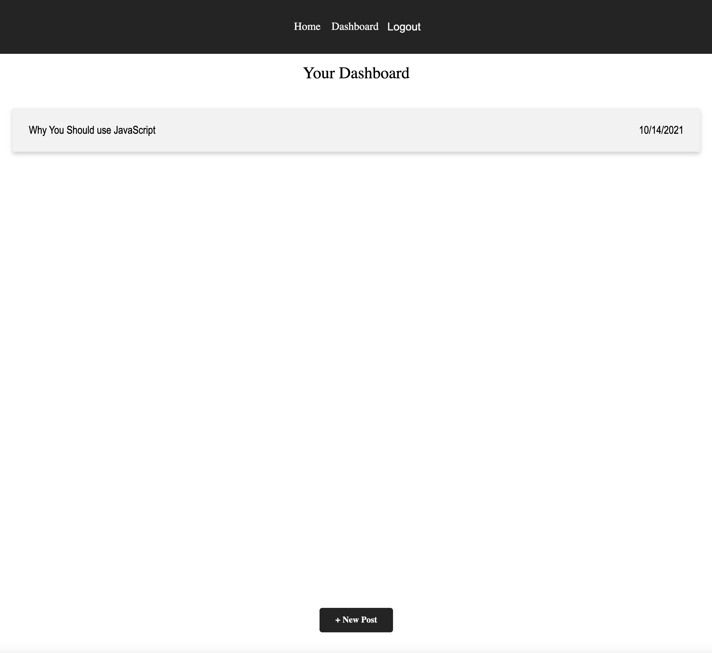
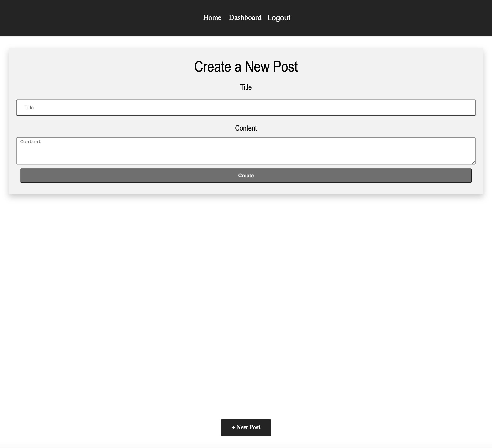
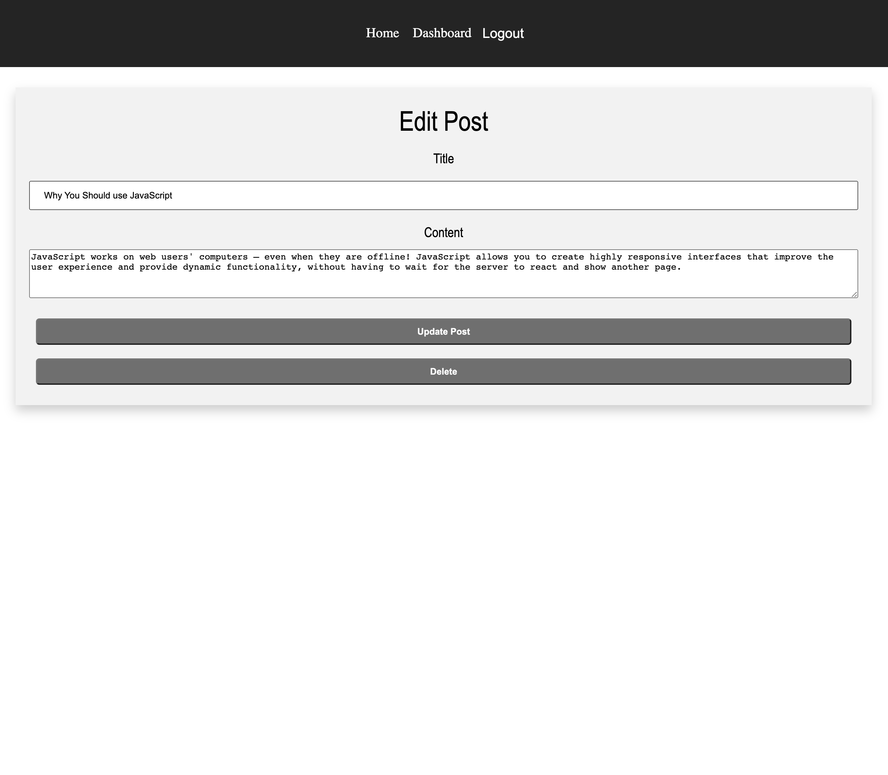

# Tech Blog

## Description

This application allows all users even those that are not signed up or logged in to view all of the blog posts and even see the comments when clicking on a specific post. When the user signs up or logs in, they can now comment on a post and even create their own. The user also has the ablity to update or delete a created post. 

## Table of Contents

- [Usage](#usage)
- [License](#license)
- [How to Contribute](#contribute)
- [Questions](#questions)

  ## Usage
After entering into the website, you can do the following.

1. Login or Sign up.

2. View all of the posts in 'Home'.

3. If Logged in, you can make a post.

4. If Logged in, you can comment on a post.

5. If Logged in, you can update your posts.

6. If Logged in, you can delete a post.

### Website Pictures
 

# Below you will see the first page of this application

 

# Below you will see the login page 

 

 

# Below you will see the comment section of this application

 

# Below you will see the dashboard page of this application for seeing created posts

 

# Below you will see the create page of this application for updating a post or deleting it 

 

# Below you will see the edit page of this application for updating a post or deleting it 

 

 

# Website URL

https://mighty-reaches-19141.herokuapp.com/

## License

The license used for this project: MIT

## Contribute

If you would like to contribute please contact me!

## Questions

To reach me please contact me in the email address below!

- GitHub: https://github.com/KarenHarley
- Email: karenharley88@gmail.com
